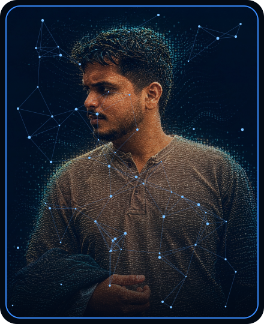

<!-- ========================================================================= -->
<!-- HERO / HEADER SECTION                                                     -->
<!-- ========================================================================= -->

  

   

  <!-- Top Navigation & Badges -->
  
  
  
  
  

 

<!-- ========================================================================= -->
<!-- PROFILE HERO CARD & AVATAR ALIGNMENT                                      -->
<!-- ========================================================================= -->

  <table>
    <tr>
      <td width="32%" align="center" valign="middle">
        
      </td>
      <td width="68%" valign="middle" align="left">
        <h2>Mohammed Maaz A</h2>
        
<b>Automation Analyst &bull; Agentic AI & SAP Specialist &bull; Full-Stack Engineer</b>

        
Designing and orchestrating high-throughput enterprise automation workflows with <b>UiPath</b>, <b>Power Automate</b>, <b>SAP BTP/BPA</b>, and integrating <b>Autonomous Agentic AI</b> into mission-critical business cycles.

        

          Founder of <a href="https://discussit.in"><b>&lt;discuss/&gt;</b></a> (real-time community platform deployed on Google Play closed testing & web at <a href="https://discussit.in">discussit.in</a>) and hackathon winner across <b>ImpactX</b>, <b>OpenAI Codex</b>, and <b>Cognizant Neuro SAN AI</b> challenges.
        

        

          
          
        

      </td>
    </tr>
  </table>

 

<!-- ========================================================================= -->
<!-- GITHUB ENGINEERING TELEMETRY & LIVE METRICS                               -->
<!-- ========================================================================= -->

## GitHub Engineering Analytics

  <table>
    <tr>
      <td width="50%" align="center">
        
      </td>
      <td width="50%" align="center">
        
      </td>
    </tr>
    <tr>
      <td width="50%" align="center">
        
      </td>
      <td width="50%" align="center">
        
      </td>
    </tr>
    <tr>
      <td width="50%" align="center">
        
      </td>
      <td width="50%" align="center">
        
      </td>
    </tr>
  </table>

 

<!-- ========================================================================= -->
<!-- FEATURED FLAGSHIP PLATFORM                                                -->
<!-- ========================================================================= -->

## Flagship Platform: `<discuss/>`

  <table>
    <tr>
      <td align="left">
        <h3><a href="https://discussit.in">&lt;discuss/&gt; — Modern Community & Discussion Ecosystem</a></h3>
        
<b>Founder & Lead Architect</b> &nbsp;|&nbsp; <b>Live Web:</b> <a href="https://discussit.in"><b>discussit.in</b></a> &nbsp;|&nbsp; <b>Mobile:</b> Google Play Store (Closed Testing)

        
A full-scale, real-time social networking application architected from scratch to enable high-speed community discourse, structured thread curation, instant multimedia sharing, and dynamic user feeds.

        

          
          
          
          
          
        

      </td>
    </tr>
  </table>

 

<!-- ========================================================================= -->
<!-- TECHNICAL COMPETENCY MATRIX                                               -->
<!-- ========================================================================= -->

## Technical Competency Matrix

<table>
  <tr>
    <td width="25%"><b>Enterprise Automation & SAP</b></td>
    <td>
      
      
      
      
      
      
      
      
    </td>
  </tr>
  <tr>
    <td width="25%"><b>AI & Cloud Engineering</b></td>
    <td>
      
      
      
      
      
    </td>
  </tr>
  <tr>
    <td width="25%"><b>Programming & Databases</b></td>
    <td>
      
      
      
      
      
      
      
    </td>
  </tr>
  <tr>
    <td width="25%"><b>Data Analytics & Intelligence</b></td>
    <td>
      
      
      
      
      
      
      
    </td>
  </tr>
  <tr>
    <td width="25%"><b>Full-Stack Web & Dev Tools</b></td>
    <td>
      
      
      
      
      
      
      
      
      
    </td>
  </tr>
</table>

 

  

 

<!-- ========================================================================= -->
<!-- PROFESSIONAL EXPERIENCE                                                   -->
<!-- ========================================================================= -->

## Professional Experience

### **Cognizant** &nbsp;|&nbsp; *Analyst (Automation)*
`Aug 2025 – Present` &nbsp;|&nbsp; `Bengaluru, India`

- **Enterprise Automation Solutions**: Architect and maintain scalable automation suites across UiPath, Microsoft Power Automate, and Python to eliminate manual operational workloads.
- **SAP Build Process Automation (BPA)**: Design and implement end-to-end enterprise workflow automation for complex multi-tier business approvals and system tasks.
- **SAP BTP & UI5/Fiori**: Build and maintain responsive SAP UI5/Fiori applications within SAP Business Application Studio (BAS) running on SAP Business Technology Platform.
- **Enterprise Integrations**: Develop robust REST API connectors and automation bridges linking enterprise services, ERPs, and databases.
- **Agentic AI Initiatives**: Implement autonomous Agentic AI frameworks and GenAI orchestration into enterprise workflow automation.

---

### **MSA Software** &nbsp;|&nbsp; *Software Testing & QA Engineer*
`Apr 2025 – Aug 2025` &nbsp;|&nbsp; `Bengaluru, India`

- **Test Suite Formulation**: Authored and executed structured test suites covering functional, regression, and exploratory validation for multi-platform products (Web, Android, Smart TV, and Widgets).
- **Payment & Workflow Testing**: Tested backend transactional workflows and integrated payment gateways under rigorous test cases.
- **Defect Tracking**: Identified defects, logged detailed tickets in Jira, and tracked sprint verification in Notion to ensure high software quality.

---

### **Freelance Engineering** &nbsp;|&nbsp; *Full Stack Developer*
`2025`

- **PrimKart E-Commerce Platform**: Delivered a full-stack e-commerce application using React, Next.js, and Tailwind CSS featuring complete payment checkout flows, dynamic product filtering, and an administrative control dashboard.

 

<!-- ========================================================================= -->
<!-- NOTABLE PROJECTS & INNOVATIONS                                            -->
<!-- ========================================================================= -->

## Featured Projects & Innovations

<table>
  <tr>
    <td width="50%" valign="top">
      <h3><a href="https://discussit.in">&lt;discuss/&gt; (discussit.in)</a></h3>
      
<b>Founder & Solo Developer</b>

      
Modern social discussion platform deployed on <b>Google Play Store</b> (closed testing) and web at <a href="https://discussit.in">discussit.in</a>. Features real-time feeds, community threads, and responsive mobile architecture.

      

        
        
        
      

    </td>
    <td width="50%" valign="top">
      <h3>DukaanSetu</h3>
      
<b>OpenAI × NamasteDev Codex Hackathon (Top 30% / 2,989)</b>

      
AI-powered digital commerce bridge enabling local retail merchants to automate product catalogs, customer engagement, and multilingual conversational ordering via LLMs.

      

        
        
        
      

    </td>
  </tr>
  <tr>
    <td width="50%" valign="top">
      <h3>BunkBuddy</h3>
      
<b>CODE4HOPE / ImpactX Hackathon Winner (1st Place)</b>

      
Award-winning intelligent student attendance and academic planning utility calculating attendance metrics, margin buffers, and smart timetable alerts.

      

        
        
        
      

    </td>
    <td width="50%" valign="top">
      <h3>Cognizant Neuro SAN AI Multi-Agent Engine</h3>
      
<b>Cognizant Neuro SAN AI Challenge & OpenAI Codex Hackathon</b>

      
Autonomous multi-agent orchestration architecture executing complex software engineering workflows, code review pipelines, and enterprise automation across the SDLC.

      

        
        
        
      

    </td>
  </tr>
</table>

 

<!-- ========================================================================= -->
<!-- HONORS & HACKATHON RECOGNITIONS                                           -->
<!-- ========================================================================= -->

## Honors & Hackathon Recognitions

- **1st Place Winner (Education Track)** — *CODE4HOPE / ImpactX Hackathon (Sep 2024)* for **BunkBuddy**.
- **Top 30% Finalist (Out of 2,989 Participants)** — *OpenAI × NamasteDev Codex Hackathon (July 2026)* for **DukaanSetu**.
- **Applied Agentic AI in SDLC** — *OpenAI Codex × Cognizant Hackathon (Aug 2026)*.
- **Autonomous Multi-Agent Challenge** — *Cognizant Neuro SAN AI Agents Challenge (July 2026)*.
- **Founder & Solo Developer** — *Discuss: Social Platform ([discussit.in](https://discussit.in) & Google Play Closed Testing)*.

 

<!-- ========================================================================= -->
<!-- CERTIFICATIONS & INDUSTRY CREDENTIALS                                     -->
<!-- ========================================================================= -->

## Certifications & Industry Credentials

  
  
  
    
  
  
  
    
  
  
  
  

 

<!-- ========================================================================= -->
<!-- EDUCATION                                                                 -->
<!-- ========================================================================= -->

## Education

- **Master of Computer Applications (MCA)** — *Mangalayatan University (Distance Learning)* &nbsp;|&nbsp; `Oct 2025 – Present`
- **Bachelor of Computer Applications (BCA)** — *Acharya Institute of Graduate Studies* &nbsp;|&nbsp; `Aug 2022 – Jul 2025`

 

<!-- ========================================================================= -->
<!-- FOOTER & CONNECT                                                          -->
<!-- ========================================================================= -->

  
   
  Designed for <b>Mohammed Maaz A</b> &nbsp;|&nbsp; Explore <a href="https://discussit.in"><b>&lt;discuss/&gt;</b></a> &nbsp;|&nbsp; Visit <a href="https://maazprofile.tech"><b>maazprofile.tech</b></a> &nbsp;|&nbsp; Connect on <a href="https://linkedin.com/in/mohammed-maaz-a-0aa730217"><b>LinkedIn</b></a>

